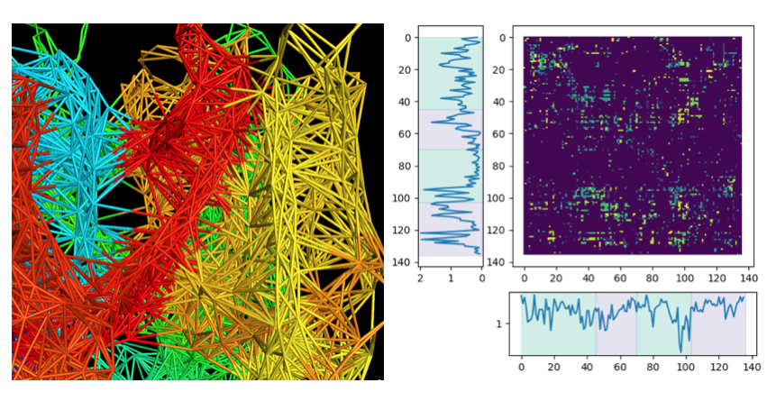

# MD simulations set-up and data analysis
This repository contains tools and scripts for analyses of molecular dynamics simulations. 

(An example of allosteric network analysis. Left, protein network visualized in PyMOL; Right, entropy transfer between different residues and statistices on each residue.)

## Topics 

### System preparation: 
- Model the missing loop 

### Simulation configuration & submission:
- Configuration files for vanilla MD
- Configuration files for enhanced sampling MD
- Job submission 
- Shell scripting to automate jobs 

### Analyses of simulations
- Visualization in VMD & PyMOL
- Membrane-related analyses: hydrophobic thickness, acyl chain order parameter etc;
- Protein-related analyses: RMSD, RMSF, contact map, secondary structure analyses, allosteric network etc;
- Enhanced sampling-related anlysis: MBAR, WHAM, EXP, TI etc; 

